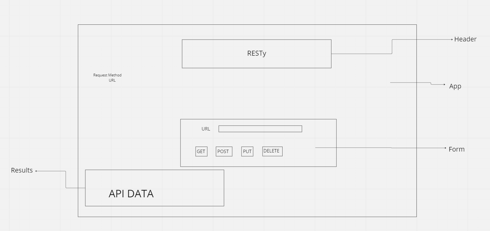

# resty

## Lab 26

Based on starter code change the classes into functions
Added hooks

## Build

npm start

## Deployed URL

[CodeSandbox - Class 26](https://codesandbox.io/p/github/JMCov/resty/base?file=%2FREADME.md&workspace=%257B%2522activeFileId%2522%253A%2522clfipbas40003g1cwa0ai6dn6%2522%252C%2522openFiles%2522%253A%255B%255D%252C%2522sidebarPanel%2522%253A%2522EXPLORER%2522%252C%2522gitSidebarPanel%2522%253A%2522COMMIT%2522%252C%2522spaces%2522%253A%257B%2522clfiymf3y008u356lqgtfoolr%2522%253A%257B%2522key%2522%253A%2522clfiymf3y008u356lqgtfoolr%2522%252C%2522name%2522%253A%2522Default%2522%252C%2522devtools%2522%253A%255B%257B%2522key%2522%253A%2522clfiymq8s00nm356lndlvmkmn%2522%252C%2522type%2522%253A%2522PROJECT_SETUP%2522%252C%2522isMinimized%2522%253Afalse%257D%252C%257B%2522type%2522%253A%2522PREVIEW%2522%252C%2522taskId%2522%253A%2522start%2522%252C%2522port%2522%253A3000%252C%2522key%2522%253A%2522clfiymf3z008w356l90vnk5gt%2522%252C%2522isMinimized%2522%253Afalse%257D%255D%257D%257D%252C%2522currentSpace%2522%253A%2522clfiymf3y008u356lqgtfoolr%2522%252C%2522spacesOrder%2522%253A%255B%2522clfiymf3y008u356lqgtfoolr%2522%255D%252C%2522hideCodeEditor%2522%253Afalse%257D)

[CodeSandbox - Class 27](https://codesandbox.io/p/github/JMCov/resty/state?file=%2FREADME.md&workspace=%257B%2522activeFileId%2522%253A%2522clfipbas40003g1cwa0ai6dn6%2522%252C%2522openFiles%2522%253A%255B%255D%252C%2522sidebarPanel%2522%253A%2522EXPLORER%2522%252C%2522gitSidebarPanel%2522%253A%2522COMMIT%2522%252C%2522spaces%2522%253A%257B%2522clfiyo2j5018y356l60c8w96v%2522%253A%257B%2522key%2522%253A%2522clfiyo2j5018y356l60c8w96v%2522%252C%2522name%2522%253A%2522Default%2522%252C%2522devtools%2522%253A%255B%257B%2522type%2522%253A%2522TASK_LOG%2522%252C%2522taskId%2522%253A%2522start%2522%252C%2522key%2522%253A%2522clfiyo73k01g4356ljkqacujo%2522%252C%2522isMinimized%2522%253Afalse%257D%252C%257B%2522key%2522%253A%2522clfiyo2j5018z356la8llbil3%2522%252C%2522type%2522%253A%2522PROJECT_SETUP%2522%252C%2522isMinimized%2522%253Afalse%257D%252C%257B%2522type%2522%253A%2522PREVIEW%2522%252C%2522taskId%2522%253A%2522start%2522%252C%2522port%2522%253A3000%252C%2522key%2522%253A%2522clfiyo6xk01e0356ldxow0mqe%2522%252C%2522isMinimized%2522%253Afalse%257D%255D%257D%257D%252C%2522currentSpace%2522%253A%2522clfiyo2j5018y356l60c8w96v%2522%252C%2522spacesOrder%2522%253A%255B%2522clfiyo2j5018y356l60c8w96v%2522%255D%252C%2522hideCodeEditor%2522%253Afalse%257D)

## UML

